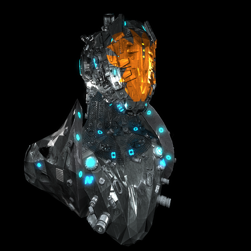

This is my first graphics engine, written in OpenGL 4.6 and C++20.

It's main purpose was to test different approaches to programming and learn basics of shading.

Branch **main** contains scene to test PBR and Bloom.
The result looks like this:

## Used libraries: 
- [GLFW](https://github.com/glfw/glfw#head1234)
- [ASSIMP](https://github.com/assimp/assimp)
- [GLAD](https://glad.dav1d.de/)
- [GLM](https://github.com/g-truc/glm)
- [DEAR IMGUI](https://github.com/ocornut/imgui)
- [STB_IMAGE](https://github.com/nothings/stb)

## Implemented abstractions:
- Free camera
- Input
- Basic OpenGL resources: buffers, framebuffers, shader programs and texures
- Resource manager
- Gui made in Dear ImGui
- Renderer with indirect drawing and bindless textures
- Signals, sorted vector, safe GL handles
- Window